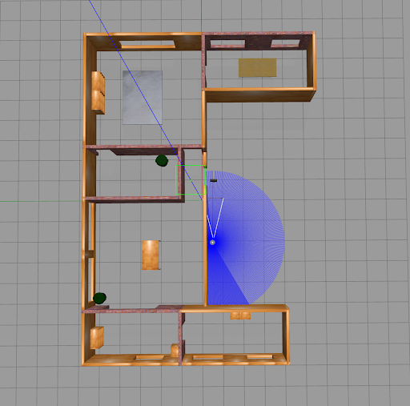
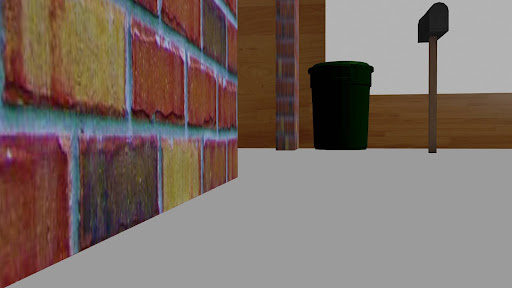

# Autonomous Navigation + Depth Estimation

This projects assumes that you have ROS2 installed. If you don't, please follow the instructions of this [link](https://docs.ros.org/en/humble/Installation/Ubuntu-Install-Debians.html). We will be using ROS2 Humble.

We have also used the tutorial displayed in this [link](https://github.com/luizeduarte/turtlebot3-simulation-gazebo) to set up the simulation environment for turtlebot3.

## Downloading ROS2 packages

First, we need to install the turtlebot3 packages, for more references see [here](https://github.com/luizeduarte/turtlebot3-simulation-gazebo). To do so, run the following command:

```bash
cd ./src/
git clone -b humble-devel https://github.com/ROBOTIS-GIT/DynamixelSDK.git
git clone -b humble-devel https://github.com/ROBOTIS-GIT/turtlebot3_msgs.git
git clone -b humble-devel https://github.com/ROBOTIS-GIT/turtlebot3.git
git clone -b humble-devel https://github.com/ROBOTIS-GIT/turtlebot3_simulations.git
```

Second, download `vision_opencv` package. For more information, see [here](https://github.com/ros-perception/vision_opencv/tree/rolling/cv_bridge). It also requires to install `opencv` and packages.

```bash
cd ./src/
git clone https://github.com/ros-perception/vision_opencv.git
```

We already have the package built by us `src/turtlebot3_image` which is responsible for the image processing and saving. Also the package `src/custom_turtle` which is responsible for the autonomous navigation.

## Building the packages

Now, we need to build the packages. To do so, run the following command:

```bash
colcon build
```

## Running the simulation

To run the simulation in Gazebo, run the following command:

```bash
cd ./
ros2 launch turtlebot3_gazebo turtlebot3_world.launch.py
```

You can then accompany the simulation in Gazebo.



## Running the autonomous navigation

To run the autonomous navigation, run the following command:

```bash
ros2 run custom_turtle turtle_movement
```

## Running the image processing

Simultaneously, in order to run the image processing, run the following command:

```bash
ros2 run turtlebot3_image image_saver
```

This will save the images in the `./data/raw_images` folder.



## Running the depth estimation

On your environment, run the following command:

```bash
python depth_estimation.py
```

The output will be saved in a .png file.


